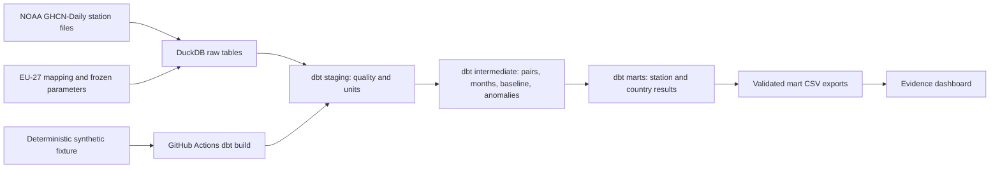

[Open ClimatePulse](https://climatepulse.lilac-emu-7363.chatgpt.site)

# ClimatePulse

ClimatePulse measures monthly temperature anomalies for a quality-controlled sample of European weather stations. It pairs NOAA GHCN-Daily `TMAX` and `TMIN` readings, compares 2021–2025 months with a fixed 1991–2020 baseline, and publishes tested station, country, and included-country marts through dbt and an Evidence dashboard.

**Scope:** The frozen universe has 640 stations in 15 EU member states. Twelve EU countries have no qualifying stations. The headline series is an equal-weight average of *available covered countries*, never a complete EU-27, area-weighted, or population-weighted measure. Monthly contributor counts and missing rows remain visible. The current product reports temperature anomalies; it does not make a separate extreme-event claim.

## Findings in the frozen snapshot

- The mean of the 60 monthly included-country anomalies for 2021–2025 is **+0.94 °C** against the fixed baseline. This is a descriptive average of monthly values, not a complete EU estimate.
- Contributing countries vary between **13 and 15**. **23 of 60 months** have fewer than all 15 represented countries.
- Four countries have only one final station. Germany has 277 and Sweden has 100. The country-first rule prevents those station-rich countries from dominating the headline mean, but does not make one-station countries spatially representative.
- The country-first and direct station averages differ by over 0.01 °C in 59 of 60 months in this snapshot. See [mart contracts](docs/mart_contracts.md) for reconciliation details.

[Open the four-step introduction](dashboard/pages/index.md) · [Dashboard source](dashboard/pages/dashboard.md) · [Data dictionary](docs/data_dictionary.md) · [Methodology](docs/anomaly_methodology.md) · [Architecture review](docs/architecture_review.md)

## Architecture



Five views and eight tables form the dbt analytical layer. Model grains, key uniqueness, arithmetic, and reconciliation are tested. CI builds the same models from a small synthetic source without downloading NOAA files.

## Quick verification from a fresh checkout

Requires Python 3.12.14 or compatible Python 3.12, Node.js, and npm. The fixture path is fully self-contained and needs no secrets or NOAA download.

```sh
python3.12 -m venv .venv
.venv/bin/python -m pip install -r requirements.txt
.venv/bin/python scripts/create_ci_fixture.py
.venv/bin/dbt debug --profiles-dir . --target ci
.venv/bin/dbt build --profiles-dir . --target ci --exclude tag:production_snapshot
cd dashboard
npm ci
npm run sources
npm run build
```

The checked-in dashboard CSVs are generated only from the tested production marts. `npm run build` uses those exports; it does not require a raw NOAA download or local production DuckDB database. Run `npm run dev` in `dashboard/` for a local preview. The home page introduces the data in four short steps; readers can skip directly to `/dashboard/`. See [dashboard data provenance](docs/dashboard_data.md). The `/faq/` page explains the data by topic in plain language. `/breakdown/` explores four selected anomaly months with coverage, country or station detail, and external reports. Intro typography uses locally hosted Jeju Hallasan and Julius Sans One; dashboard typography remains unchanged.

## Full production reproduction

The original raw station files are intentionally excluded from Git. Download the source metadata and candidate station files from NOAA, then regenerate the frozen universe and marts. This creates a **new live NOAA snapshot**, so compare its manifest and mart counts with the tracked frozen snapshot before treating the dashboard exports as equivalent. NOAA can revise historical files. The tracked manifest detects drift but does not recover old source bytes.

```sh
mkdir -p data/raw/metadata
curl -o data/raw/metadata/ghcnd-stations.txt https://www.ncei.noaa.gov/pub/data/ghcn/daily/ghcnd-stations.txt
curl -o data/raw/metadata/ghcnd-inventory.txt https://www.ncei.noaa.gov/pub/data/ghcn/daily/ghcnd-inventory.txt
.venv/bin/python scripts/select_eu_stations.py
.venv/bin/python scripts/download_noaa_stations.py
.venv/bin/python scripts/evaluate_station_completeness.py
.venv/bin/python scripts/evaluate_monthly_completeness.py
.venv/bin/python scripts/select_final_stations.py
.venv/bin/python scripts/ingest_noaa_to_duckdb.py
.venv/bin/python scripts/ingest_project_inputs_to_duckdb.py
.venv/bin/dbt build --profiles-dir .
.venv/bin/python scripts/export_marts_for_dashboard.py
cd dashboard && npm run sources && npm run build
```

The production ingestion reads 971 metadata-qualified candidate station files. The January 2021–December 2025 mart grid excludes raw observations from 2026. Full details: [source contract](docs/noaa_source_contract.md), [raw ingestion](docs/raw_ingestion_design.md), [staging](docs/staging_contracts.md), [methodology](docs/anomaly_methodology.md), [marts](docs/mart_contracts.md), and [CI fixture](docs/ci_fixture.md).

## NOAA citation and provenance

Source: NOAA National Centers for Environmental Information, **Global Historical Climatology Network–Daily (GHCN-Daily)**, station CSV files under [`by_station`](https://www.ncei.noaa.gov/pub/data/ghcn/daily/by_station/). NOAA's [dataset readme](https://www.ncei.noaa.gov/pub/data/ghcn/daily/readme.txt) gives the dataset DOI [10.7289/V5D21VHZ](https://doi.org/10.7289/V5D21VHZ) and asks users to state the accessed version/subset and access date. The tracked [source manifest](data/manifests/noaa_station_files_manifest.csv) records file checksums and ingestion timestamps for the frozen snapshot. A later download may differ.

## Repository and release notes

`requirements.txt` pins the direct Python dependencies. `dashboard/package-lock.json` locks the Evidence dependency tree. DuckDB databases, NOAA source bytes, virtual environments, dbt output, installed Node packages, and Evidence build files are ignored. The four validated CSV marts and their SHA-256 manifest are tracked as the deployable data contract. No credentials are required for the fixture or dashboard build.
